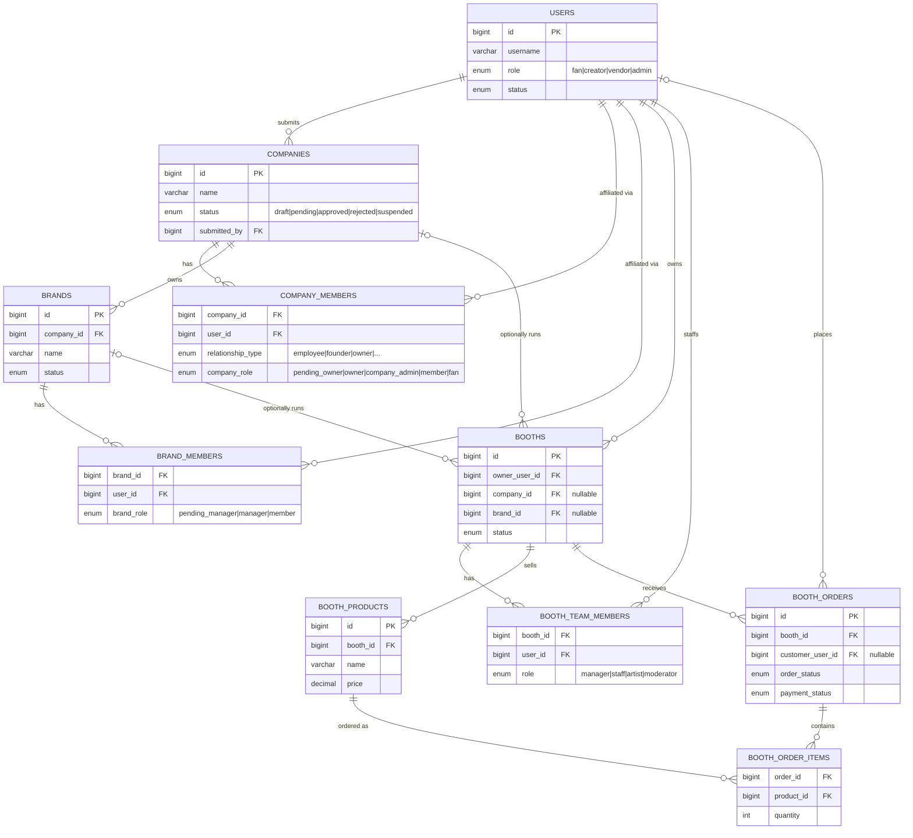
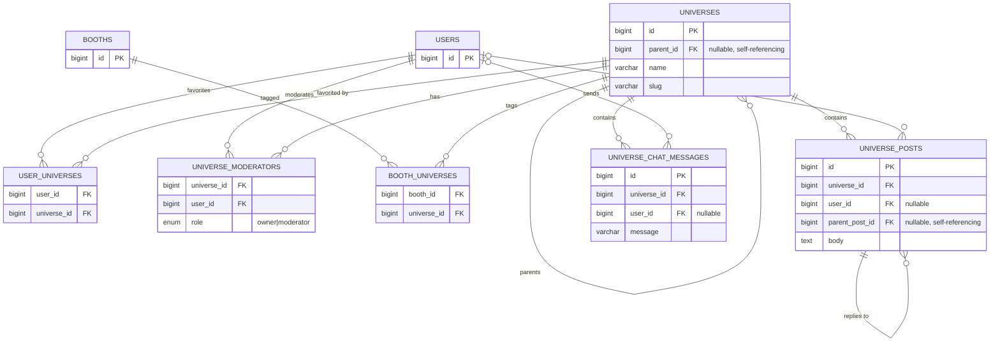
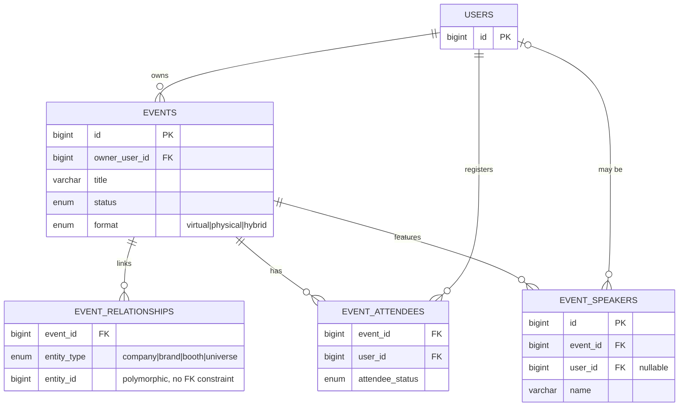
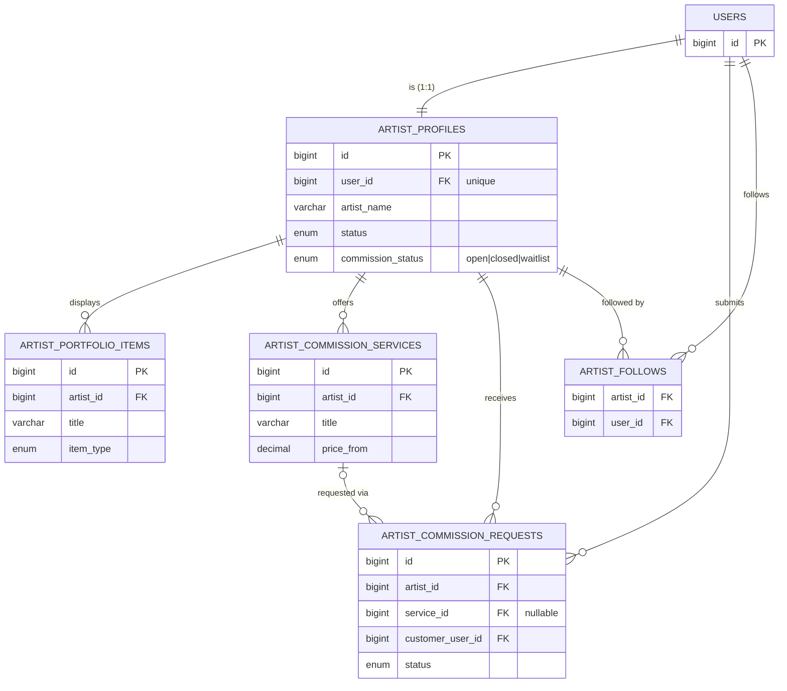
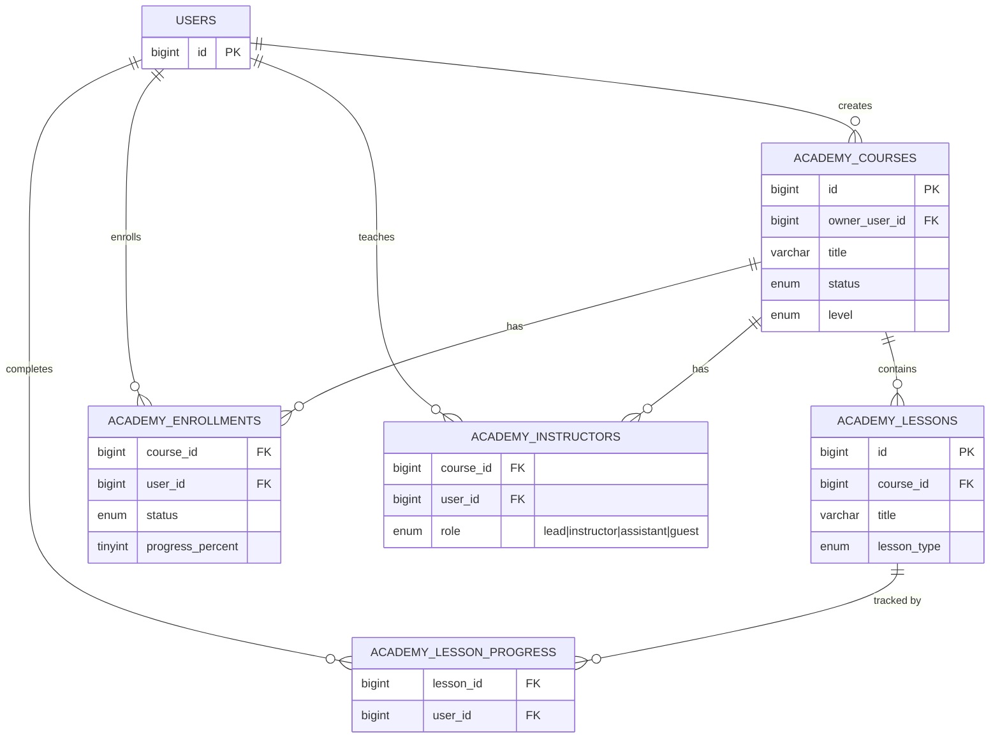
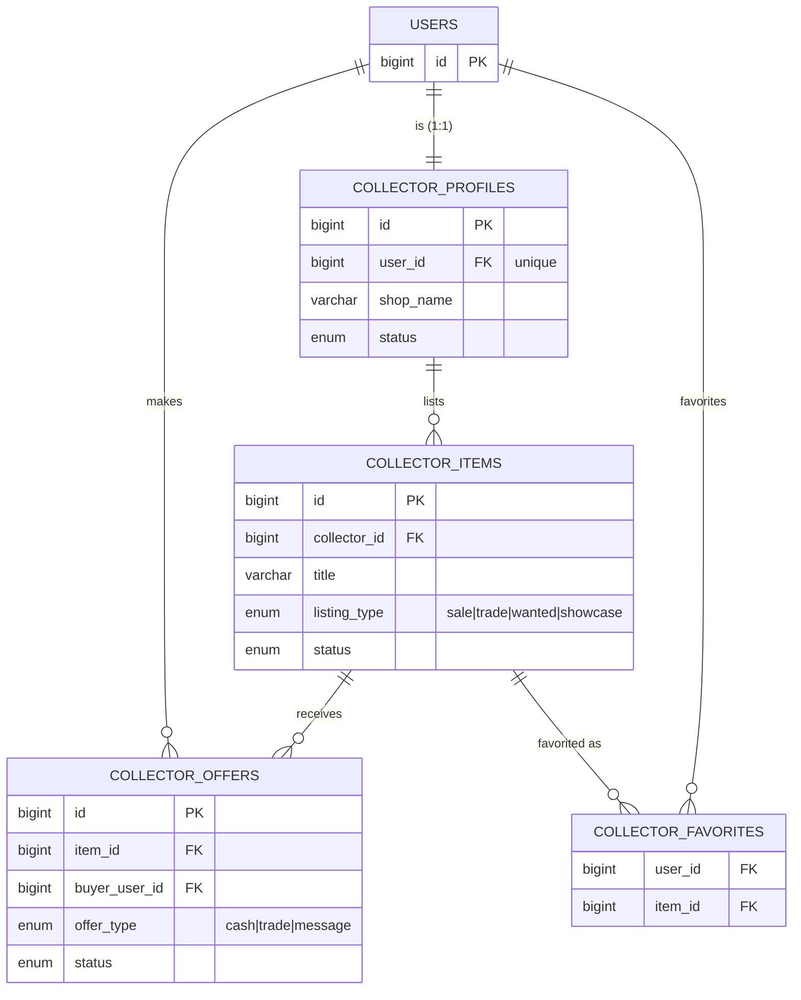
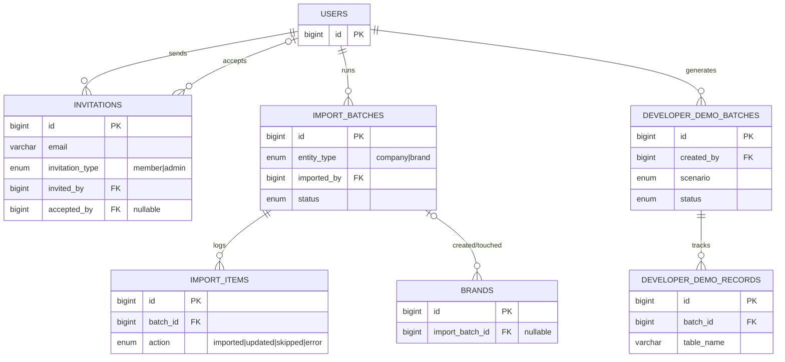

# Geek Nation Multiverse — Data Model

This document is the entity-relationship reference for the platform. It did not exist before this
was written — cross-check it against `database/*.sql` if a table has changed shape since.

There is no `individuals` table. A person is a row in `users`; every role-specific concept
(company staff, brand staff, booth owner, artist, collector, instructor, event attendee) is a
table that points back to `users.id`, not a parallel identity system.

## How to read the diagrams

Crow's-foot notation, standard Mermaid ER conventions:

| Symbol | Meaning |
|---|---|
| `\|\|` | exactly one |
| `\|o` | zero or one (nullable FK on that side) |
| `o{` | zero or many |
| `\|{` | one or many |

So `COMPANIES \|o--o{ BOOTHS` reads: *each booth belongs to zero-or-one company, each company has
zero-or-many booths* — the nullable `booths.company_id` column. Junction tables (`company_members`,
`booth_team_members`, etc.) are drawn as their own boxes with a `\|\|--o{` line in from each side they
join, matching how the schema actually enforces them (two FK columns + a composite/unique key),
rather than a single many-to-many arrow.

Each section below is one module's slice of the schema, kept separate for readability. `users` is
repeated in every diagram as the anchor point — it is the same table throughout.

---

## 1. Organizations & Commerce — Companies, Brands, Booths

The core hierarchy: a **brand** always belongs to exactly one **company**; a **booth** is always
owned by a **user** and may *optionally* be attached to a company, a brand, both, or neither.

Companies and brands share the same submission/approval shape: `status`, `submitted_by`,
`reviewed_by`, plus a `*_approval_history` audit table (omitted above for space — see
`database/companies.sql` and `database/brands-imports.sql`).

---

## 2. Universes & Community

Universes are a shared taxonomy/social layer, not owned by any company or brand. They self-nest
via `parent_id`, and both booths and users can tag into them independently.

---

## 3. Events — the cross-cutting glue

Events are the one entity that references companies, brands, booths, *and* universes — but through
a single **polymorphic** join table (`event_relationships.entity_type` + `entity_id`) rather than
four separate FK columns. There is no database-level foreign key on `entity_id`; the application
layer resolves it based on `entity_type`.

---

## 4. Artist Alley — the independent-creator storefront

An artist profile is a 1:1 extension of a user, parallel to (not part of) the company/brand/booth
chain — a solo creator never needs a company record to sell commissions.

---

## 5. Multiverse Academy

---

## 6. Collector Marketplace

Another independent, user-level storefront — same pattern as Artist Alley, different domain
(physical/digital collectibles instead of commissioned art).

---

## 7. Admin, Imports & Platform Operations

Bulk CSV/TSV import of companies and brands (see `IMPORTS.md`), user invitations, and the
Developer Center's disposable demo-data generator all live here.

---

## Key rules worth remembering

- **`users` is the only identity table.** Artist, collector, booth-owner, company-member, and
  instructor are all roles a user takes on, not separate people records.
- **Brands always have exactly one parent company** (`brands.company_id NOT NULL`). Companies do
  not require a brand.
- **Booths are independent of the company/brand chain.** `company_id` and `brand_id` on `booths`
  are both nullable and unrelated to each other — a booth can stand alone, belong to a company,
  belong to a brand, or (in practice) both.
- **Universes are a shared taxonomy**, not owned by companies/brands. Booths, users, and events all
  tag into them, but universes don't belong to anyone.
- **Artist Alley and Collector Marketplace are parallel, solo-creator storefronts** off a single
  user — structurally siblings of booths, not children of them.
- **Events are the only entity with a polymorphic relationship** (`event_relationships`), letting
  one event reference any mix of company/brand/booth/universe without four nullable FK columns.
- Every submission-based entity (companies, brands, booths, events, courses, artist profiles)
  follows the same **draft → pending → approved/rejected** admin-review shape, usually with a
  paired `*_approval_history` audit table.

## Source of truth

| Module | Schema file |
|---|---|
| Users, identity, profiles, universes (base), invitations | `database/schema.sql`, `database/identity.sql`, `database/invitations.sql` |
| Companies | `database/companies.sql` |
| Brands + Import Center | `database/brands-imports.sql` |
| Universe hierarchy extras (moderators, activity) | `database/universe-engine.sql` |
| Universe Billboard (posts) | `database/universe-billboards.sql` |
| Universe live chat | `database/universe-community-v4.4.sql` |
| Booths & Marketplace foundation | `database/booths-marketplace.sql` |
| Booth management (team, gallery, downloads, views) | `database/booth-management-v5.1.sql` |
| Developer Center | `database/developer-center-v5.2.sql` |
| Events | `database/events-v6.sql` |
| Artist Alley | `database/artist-alley-v7.sql` |
| Multiverse Academy | `database/multiverse-academy-v8.sql` |
| Collector Marketplace | `database/collector-marketplace-v9.sql` |

If a table here doesn't match the live schema, the `.sql` file wins — this document is a snapshot,
regenerate the affected diagram by hand when a module's schema changes.
